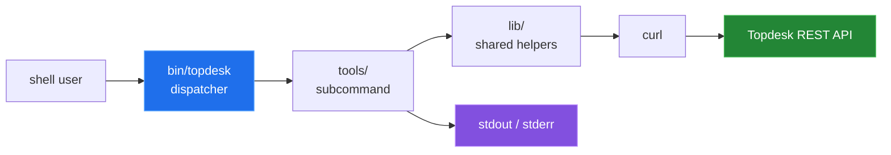
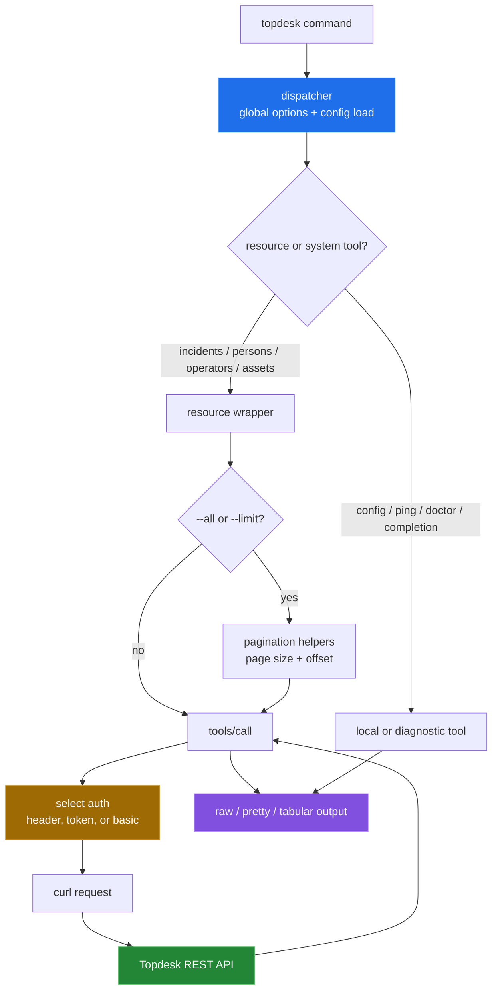

# Topdesk Toolkit (`topdesk`)

Topdesk Toolkit is a portable POSIX `sh` command line client for common Topdesk
REST operations. The `bin/topdesk` dispatcher loads configuration, selects a
tool from `tools/`, and leaves HTTP transport to `curl`; the result is ordinary
stdout/stderr that can be composed with other shell commands.



## Quick start

These local commands were run from the repository checkout and do not contact a
Topdesk tenant:

```sh
./bin/topdesk --version
./bin/topdesk help
./bin/topdesk config --help
./bin/topdesk doctor --help
```

For a real API request, set a tenant URL and one supported authentication
method. The values below are placeholders and are not usable credentials:

```sh
export TDX_BASE_URL="https://tenant.example.invalid"
export TDX_AUTH_TOKEN="Bearer <token>"

./bin/topdesk ping
./bin/topdesk incidents
```

The local inspection commands are verified. The API commands require a real
tenant and credentials, so they were not run against Topdesk for this pass.

## Architecture

The dispatcher loads the selected configuration before resolving a command. A
resource wrapper either calls `tools/call` once or uses the pagination helpers
to repeat that call and shape JSON, TSV, or CSV output.



## Capability overview

| Area | Entry points | What it does |
|---|---|---|
| HTTP | `call` | Builds a `curl` request with query, body, headers, TLS, retries, and output controls. |
| Incidents | `incidents` and `incidents-*` | Lists, reads, creates, updates, annotates, uploads, and downloads incident data. |
| People and operators | `persons*`, `operators*` | Lists, searches, reads, creates, and updates records. |
| Assets | `assets*` | Lists, searches, reads, creates, and updates assets. |
| Output | list tools | Emits JSON, or jq-shaped TSV/CSV with optional headers. |
| Configuration | `config` | Finds, initializes, edits, lists, validates, and reports the active config file. |
| Health | `ping`, `doctor` | Separates API connectivity/authentication checks from local diagnostics. |
| Shell integration | `completion` | Prints Bash or Zsh completion code. |

The complete source-derived table of executable tools is in
[`docs/commands.md`](docs/commands.md).

## Measured results

The measurement scripts count the current shell source and derive the command
table from the executable files. The clean-source run used for this pass
reported:

| Measurement | Result |
|---|---:|
| shell files under `bin/`, `lib/`, and `tools/` | 35 |
| shell source lines | 3,535 |
| shell source bytes | 101,088 |
| executable tools | 27 |

The repository test command was also run in a clean source snapshot. It printed
5 passing and 28 failing checks, but returned status 0 because the test runner
does not propagate TAP failures. The failures are consistent with the
non-executable test shims and include mocked API output, fixture comparisons,
timeout/error cases, and config editor behavior. See
[`docs/measurement.md`](docs/measurement.md) for the commands and verification
boundary.

## Repository layout

```text
bin/topdesk       dispatcher and global option handling
lib/              configuration, logging, arguments, JSON, and pagination
tools/            executable command implementations
devtools/         source-shape and command-surface measurement scripts
share/examples/   configuration template
tests/            shell test suite and mocked curl/editor helpers
docs/             command table, subsystem write-ups, and measurement notes
```

## Known limitations

- No real Topdesk tenant or credentials were available, so API responses,
  authentication, uploads, downloads, and latency were not measured.
- `curl` is required. `jq` is optional for JSON formatting and required for
  tabular output and pagination helpers.
- Configuration files are shell files sourced by the client. They are plain
  text, not encrypted storage; `doctor` can warn about world-readable files.
- `call --dry-run` prints the constructed curl command, including authentication
  arguments when configured. Do not paste that output into shared logs.
- `--insecure` and `TDX_VERIFY_TLS=0` disable TLS certificate verification.
- The current `doctor` implementation can exit early in normal and quiet modes
  because suppressed helper calls return failure under `set -e`.
- The checked-in test shims are not executable, so `make test` can call real
  network tools; the test runner can still return success after TAP failures.
- Asset-template management is not exposed by the command surface; it remains
  outside this client.
