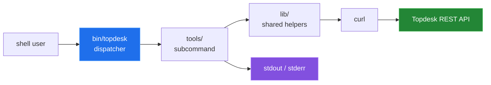
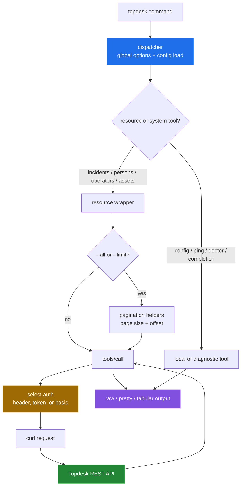

# topdesk-cli


> Pure-shell TOPdesk REST API client — automate incident management, person/operator/asset CRUD, and ITSM workflows without installing a runtime.

Topdesk Toolkit is a portable POSIX `sh` command line client for common Topdesk
REST operations. The `bin/topdesk` dispatcher loads configuration, selects a
tool from `tools/`, and leaves HTTP transport to `curl`; the result is ordinary
stdout/stderr that can be composed with other shell commands.



## Why

TOPdesk's REST API is capable but typically accessed through bespoke scripts or full programming language SDKs. topdesk-cli is a POSIX sh dispatcher that wraps the API in composable subcommands, making it scriptable from any Unix shell without Python, Node, or any language runtime beyond `curl` and optionally `jq`. It fits naturally into cron jobs, CI pipelines, and maintenance scripts that already live in shell.

## Quick start

```bash
# Install (user-local, no root)
make

# System-wide
sudo make install PREFIX=/usr/local

# First-time setup
topdesk config init
# Edit ~/.config/topdesk/config and set TDX_BASE_URL and auth vars

# Verify connectivity
topdesk ping
topdesk doctor

# List recent incidents
topdesk incidents --limit 10 --format tsv --headers

# Create an incident from a JSON payload
topdesk incidents-create --data @incident.json

# Export all persons to CSV
topdesk persons --all --fields id,networkLoginName,firstName,lastName --format csv --headers
```

### Inspect without a tenant

These local commands were run from the repository checkout and do not contact a
Topdesk tenant:

```sh
./bin/topdesk --version
./bin/topdesk help
./bin/topdesk config --help
./bin/topdesk doctor --help
```

These four commands exit 0 in a Linux container. The API commands need a real
tenant and credentials; they are covered only by the test suite's curl shim.

## How it works

- `bin/topdesk` — POSIX sh dispatcher backed by `lib/common.sh`, `lib/config.sh`, `lib/args.sh`, and `lib/log.sh`. Discovers subcommands in `tools/` and routes to them.
- `tools/call` — low-level HTTP caller with auth handling, retries, dry-run, and TLS options. All higher-level subcommands delegate to it.
- `tools/incidents*` — list, get, create, update, add-note, upload/download attachments.
- `tools/persons*`, `tools/operators*`, `tools/assets*` — full CRUD with pagination (`--all`, `--limit`, `--page-size`) and flexible output formats.
- `tools/ping` / `tools/doctor` — connectivity check and comprehensive dependency/config health check with optional `--fix`.
- `lib/paginate.sh` — automatic pagination through TOPdesk result sets.
- `tests/` — TAP test suite with a mocked curl shim; no real network traffic required.

## Architecture

The dispatcher loads the selected configuration before resolving a command. A
resource wrapper either calls `tools/call` once or uses the pagination helpers
to repeat that call and shape JSON, TSV, or CSV output.



## Capability overview

| Area | Entry points | What it does |
|---|---|---|
| HTTP | `call` | Builds a `curl` request with query, body, headers, TLS, retries, and output controls. |
| Incidents | `incidents` and `incidents-*` | Lists, reads, creates, updates, annotates, uploads, and downloads incident data. |
| People and operators | `persons*`, `operators*` | Lists, searches, reads, creates, and updates records. |
| Assets | `assets*` | Lists, searches, reads, creates, and updates assets. |
| Output | list tools | Emits JSON, or jq-shaped TSV/CSV with optional headers. |
| Configuration | `config` | Finds, initializes, edits, lists, validates, and reports the active config file. |
| Health | `ping`, `doctor` | Separates API connectivity/authentication checks from local diagnostics. |
| Shell integration | `completion` | Prints Bash or Zsh completion code. |

The complete source-derived table of executable tools is in
[`docs/commands.md`](docs/commands.md).

## Configuration

Config file at `~/.config/topdesk/config` (XDG) or a path passed with `--config`. Managed via `topdesk config`.

| Variable | Description |
|---|---|
| `TDX_BASE_URL` | TOPdesk base URL, e.g. `https://topdesk.example.com` |
| `TDX_AUTH_TOKEN` | Full Authorization header value (`Bearer …` or `Basic …`) |
| `TDX_AUTH_HEADER` | Raw custom header string (overrides token/basic auth) |
| `TDX_USER` / `TDX_PASS` | Basic auth fallback |
| `TDX_VERIFY_TLS` | `1` (default) or `0` to skip TLS verification |
| `TDX_TIMEOUT` | Request timeout in seconds (default `30`) |
| `TDX_PAGE_SIZE` | Default page size for paginated calls (default `100`) |

## Results

All results come from `devtools/linux-run.sh`, run in a
`python:3.12-slim-bookworm` container (`/bin/sh` is dash):

| Measurement | Result |
|---|---:|
| shell files under `bin/`, `lib/`, and `tools/` | 35 |
| shell source lines | 3,538 |
| shell source bytes | 101,111 |
| executable tools | 27 |
| `make test` with a fresh `HOME` | 31 of 33 pass, exit 2 |

The two failing checks are config tests that write to the real user config
instead of the test directory ([bug 5](docs/BUGS-FOUND.md#5-config-tests-write-to-the-real-user-config)).
Running the suite again in the same `HOME` fails 19 checks, so run it with a
throwaway `HOME` until that is fixed.

`doctor` runs all its sections and prints a summary in the default, `--quiet`
and `--verbose` modes. On Linux its permission check wrongly reports
`0 of 27 tools are executable` ([bug 6](docs/BUGS-FOUND.md#6-doctor-counts-no-executable-tools-on-linux)),
and it stops with exit 2 when `SHELL` is unset ([bug 7](docs/BUGS-FOUND.md#7-doctor-aborts-when-shell-is-unset)).

See [`docs/measurement.md`](docs/measurement.md) for the commands and the full
output.

## Repository layout

```text
bin/topdesk       dispatcher and global option handling
lib/              configuration, logging, arguments, JSON, and pagination
tools/            executable command implementations
devtools/         source-shape and command-surface measurement scripts
share/examples/   configuration template
tests/            shell test suite and mocked curl/editor helpers
docs/             command table, subsystem write-ups, and measurement notes
```

## Known limitations

- No real Topdesk tenant or credentials were available, so API responses,
  authentication, uploads, downloads, and latency are not covered.
- `make test` edits `~/.config/topdesk/config` (bug 5), and `doctor` has two
  open Linux issues (bugs 6 and 7). See [`docs/BUGS-FOUND.md`](docs/BUGS-FOUND.md).
- `curl` is required. `jq` is optional for JSON formatting and required for
  tabular output and pagination helpers.
- Configuration files are shell files sourced by the client. They are plain
  text, not encrypted storage; `doctor` can warn about world-readable files.
- `call --dry-run` prints the constructed curl command, including authentication
  arguments when configured. Do not paste that output into shared logs.
- `--insecure` and `TDX_VERIFY_TLS=0` disable TLS certificate verification.
- Asset-template management is not exposed by the command surface; it remains
  outside this client.

## Status

Actively maintained.

## License

MIT
