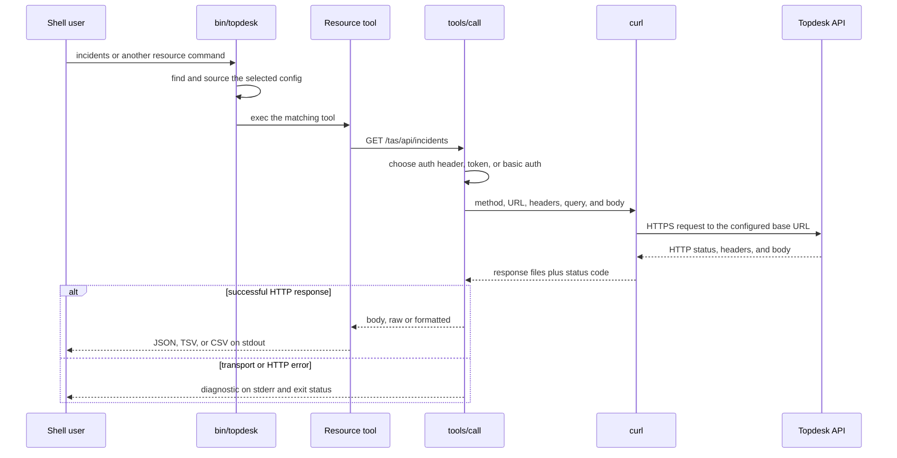

[← back to the overview](../README.md)

# API call path

The resource commands are thin wrappers around `tools/call`. The dispatcher
loads configuration first, then a list command either calls the API once or
uses the pagination helpers to repeat the same request with updated query
parameters.

## Request construction

`tools/call` joins `TDX_BASE_URL` with the requested path, appends the query
string, and gives `curl` a temporary response body and header file. `--data`
adds a request body; `--param` URL-encodes repeatable query parameters; `--raw`,
`--pretty`, `--output`, and `--tee` determine how the response is returned.

The authentication choice is ordered in the source:

| First matching setting | Request sent by `curl` |
|---|---|
| `TDX_AUTH_HEADER` | The configured header is passed with `-H`. |
| `TDX_AUTH_TOKEN` | The value is passed as `Authorization: <value>`. |
| `TDX_USER` or `TDX_PASS` | The pair is passed with `-u user:password`. |
| none | No authentication argument is added. |

The wrappers for create and update commands add JSON content and choose POST,
PATCH, or PUT. Attachment upload and download are separate direct `curl`
paths because they use multipart form data or a file output.

## Pagination and output

List wrappers use the configured page-size, page-parameter, and offset-parameter
names. `--all` keeps requesting pages until a short page or an empty page is
returned. `--limit` stops the aggregate at the requested item count. JSON
pagination is assembled with `jq`; tabular output extracts dot paths and emits
TSV or CSV, optionally preceded by a header row.

The API call path is covered by the test suite's curl shim, not by a real
tenant. The diagram describes the request flow in the source; no response body
or latency claim is implied.

## Known limitations

- A direct API call needs a configured base URL and credentials; the repository
  does not provide a safe local substitute for a Topdesk server.
- `--dry-run` prints the complete constructed command, including auth arguments
  and request data when present.
- HTTP error handling may include a response-body preview in stderr, so an API
  error response can carry data into logs.
