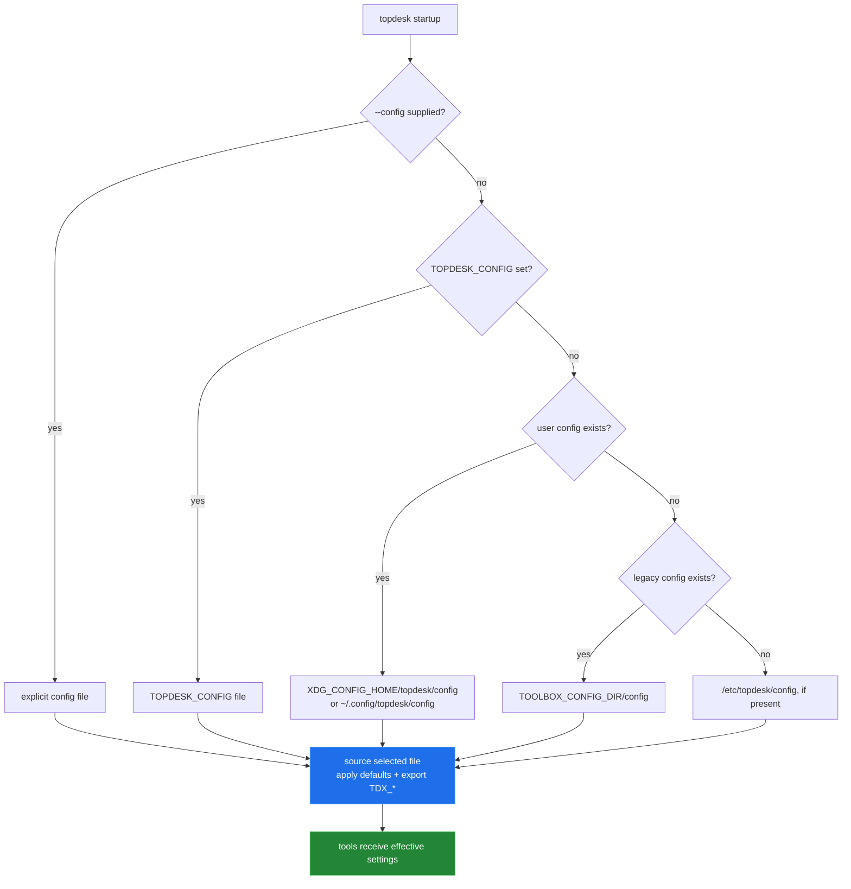

[← back to the overview](../README.md)

# Configuration and credentials

Configuration is a sourced shell file plus environment variables. It is not a
credential store: values remain plaintext wherever the user puts them, and the
client does not encrypt them.

## Where settings live

The lookup order in `lib/config.sh` is an explicit `--config` path, the file
named by `TOPDESK_CONFIG`, the user config, the legacy config location, and
the system config. If no file exists, the process can still use inherited
`TDX_*` variables. When a file is found, it is sourced, so assignments in that
file become the effective values.

The supported authentication inputs are:

| Setting | Meaning | Stored or sent as |
|---|---|---|
| `TDX_AUTH_HEADER` | An already-formatted custom header. | Plaintext config/env value; sent as a curl header. |
| `TDX_AUTH_TOKEN` | The value to place after `Authorization:`. | Plaintext config/env value; sent as an authorization header. |
| `TDX_USER` and `TDX_PASS` | Basic-auth credentials. | Plaintext config/env values; sent through curl `-u`. |

`TDX_VERIFY_TLS=0` disables certificate verification. Timeout, retry, and
pagination settings are also plain environment/config values. `config init`
creates a template; it does not encrypt the file.

## What is logged

| Operation | Secret handling in the current source |
|---|---|
| `config list` | Masks token, header, password, secret, key, and auth values; the username and base URL remain visible. |
| `call` normally | Does not print the constructed curl command. |
| `call --dry-run` | Prints the constructed curl command without redacting auth, extra headers, or request data. |
| `ping --verbose` | Masks the known auth forms, but prints the base URL, request details, response headers, and a body preview. |
| `doctor` | Reports config paths and the base URL; it does not print the auth value itself. |
| HTTP failure | `call` may print a response-body preview to stderr. |

`doctor` checks whether the selected config file is world-readable and warns if
it is. The check is advisory; the client still sources a readable plaintext
file. Keep config files out of shared logs and treat verbose or dry-run output
as sensitive.

## Known limitations

- There is no encrypted keychain, secret helper, or per-command redaction layer.
- `TDX_AUTH_HEADER` takes precedence over `TDX_AUTH_TOKEN`, which takes
  precedence over basic auth in the request-building code.
- A custom header or request body can contain secrets that the generic redaction
  code does not inspect.
