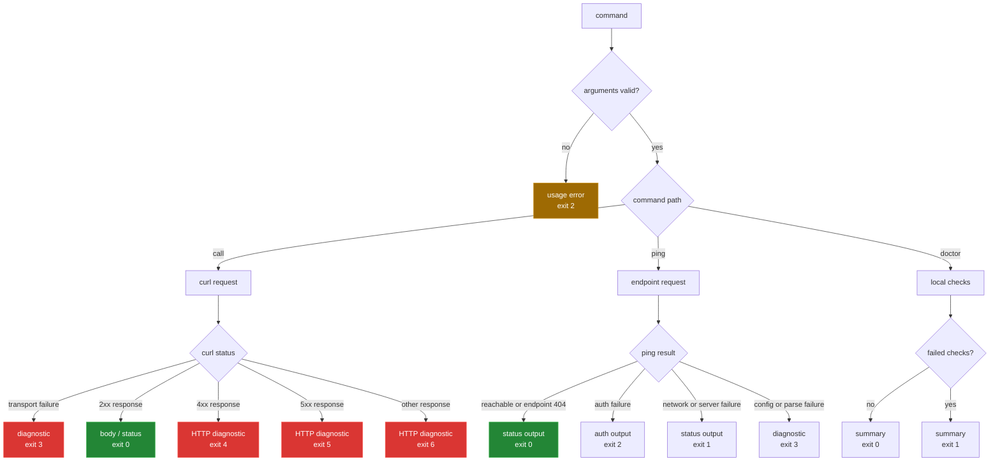

[← back to the overview](../README.md)

# Health checks and errors

`ping` answers a narrow question—can the configured endpoint be reached with
the configured authentication? `doctor` combines local dependency,
configuration, permission, path, and optional network checks. The low-level
caller exposes transport and HTTP failures separately.

## `call` failure mapping

The `tools/call` script maps curl and HTTP outcomes as follows:

| Condition | Exit | Output channel |
|---|---:|---|
| Missing method, path, required option, or base URL | 2 | Usage/error on stderr. |
| Curl transport failure, including timeout | 3 | Error on stderr; a short response preview may follow. |
| Successful `2xx` response | 0 | Response body on stdout unless written elsewhere. |
| HTTP `4xx` response | 4 | Status and response preview on stderr. |
| HTTP `5xx` response | 5 | Status and response preview on stderr. |
| Other HTTP status or missing status | 6 or 3 | Diagnostic on stderr. |

The caller removes its temporary body and header files on exit. A response sent
to `--output` is written directly to the requested path; `--tee` keeps stdout
and writes a second copy.

## `ping` and `doctor`

`ping` treats API reachability, authentication, and response parsing as
separate outcomes. It can accept a custom endpoint, and verbose mode prints
request and response diagnostics with auth masking. It cannot make an invalid
tenant or missing credential usable.

`doctor` reports missing dependencies, config problems, TLS settings, and tool
permissions. `--fix` can create a config template or adjust tool permissions,
so it is not a read-only diagnostic option.

`check_info` and `section` always return 0, so the default, `--quiet` and
`--verbose` runs reach the summary (fixed in
[`d6bc17a`](https://github.com/Bissbert/topdesk-cli/commit/d6bc17a) and
[`a5c400c`](https://github.com/Bissbert/topdesk-cli/commit/a5c400c)). The
permission check uses `find -perm -u=x`, which GNU `find` accepts, and an unset
`SHELL` prints `Shell: unknown` (both fixed in [`35eab2d`](https://github.com/Bissbert/topdesk-cli/commit/35eab2d),
[#6](https://github.com/Bissbert/topdesk-cli/issues/6) and [#7](https://github.com/Bissbert/topdesk-cli/issues/7)). `tests/doctor.sh` covers each of these.

## Known limitations

- API status behavior is covered only by the curl shim, not by a real tenant.
- A diagnostic body preview can carry sensitive server data into stderr logs.
