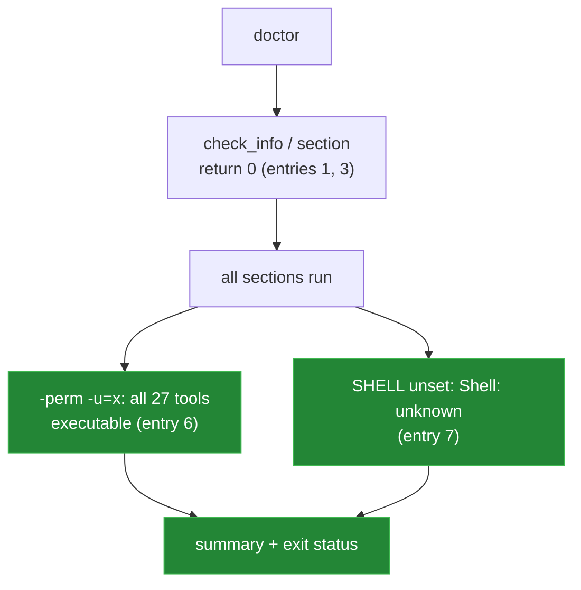

[← back to the overview](../README.md)

# Bugs found

All seven bugs are fixed. Entries 5 to 7 turned up when everything was re-run
in a Linux container (see [How this was measured](measurement.md)). Every entry
has a regression check in [`tests/`](../tests): entries 1, 3, 6 and 7 in
`doctor.sh`, entries 2, 4 and 5 in `isolation.sh`.

| # | Entry | Status |
|---|---|---|
| 1 | Suppressed `check_info` aborts `doctor` | Fixed in [`d6bc17a`](https://github.com/Bissbert/topdesk-cli/commit/d6bc17a) |
| 2 | Test shims are not executable | Fixed in [`aa52313`](https://github.com/Bissbert/topdesk-cli/commit/aa52313) |
| 3 | `doctor --quiet` aborts at the first section | Fixed in [`a5c400c`](https://github.com/Bissbert/topdesk-cli/commit/a5c400c) |
| 4 | TAP failures do not affect the exit status | Fixed in [`ab48639`](https://github.com/Bissbert/topdesk-cli/commit/ab48639) |
| 5 | Config tests write to the real user config | Fixed in [`35eab2d`](https://github.com/Bissbert/topdesk-cli/commit/35eab2d) |
| 6 | `doctor` counts no executable tools on Linux | Fixed in [`35eab2d`](https://github.com/Bissbert/topdesk-cli/commit/35eab2d) |
| 7 | `doctor` aborts when `SHELL` is unset | Fixed in [`35eab2d`](https://github.com/Bissbert/topdesk-cli/commit/35eab2d) |

The checks below run inside the container that
[`devtools/linux-run.sh`](../devtools/linux-run.sh) sets up
(`python:3.12-slim-bookworm` with bash, curl, jq and make; `/bin/sh` is dash),
from a copy of the repository.



## 1. Suppressed `check_info` aborts `doctor`

**Status:** fixed in [`d6bc17a`](https://github.com/Bissbert/topdesk-cli/commit/d6bc17a).

**File:** `tools/doctor` (`check_info`)

**What happened:** `check_info` was a short-circuiting test followed by
`printf`. Without `--verbose` the test was false, so the function returned 1,
and `set -e` ended the run after the dependency checks. The configuration,
network, permission and PATH sections and the summary never ran.

**What changed:** `check_info` ends with `return 0`.

**Check:**

```sh
probe=$(mktemp -d)
XDG_CONFIG_HOME="$probe" HOME="$probe" ./bin/topdesk doctor
```

All seven sections and the summary print (`Checks passed: 4`, `Warnings: 2`,
`Checks failed: 3` with an empty config location), and the exit status is 1
because of the failed configuration checks.

## 2. Test shims are not executable

**Status:** fixed in [`aa52313`](https://github.com/Bissbert/topdesk-cli/commit/aa52313).

**Files:** `tests/bin/curl`, `tests/bin/editor`, `tests/helpers.sh`

**What happened:** both shims were mode `0644`, so the shell skipped them on
`PATH` and ran the system `curl`. The suite made real network requests and
most assertions failed.

**What changed:** both files are mode `0755`, and `tests/helpers.sh` stops with
a setup error if `curl` or `editor` does not resolve to the shim.

**Check:**

```sh
stat -c '%A %n' tests/bin/curl tests/bin/editor
make test
```

Both files are `-rwxr-xr-x`, and `make test` ends with
`Summary: 82 passed, 0 failed`.

## 3. `doctor --quiet` aborts at the first section

**Status:** fixed in [`a5c400c`](https://github.com/Bissbert/topdesk-cli/commit/a5c400c).

**File:** `tools/doctor` (`section`)

**What happened:** `section` had the same shape as `check_info`. With
`--quiet` it returned 1 at the first call and the run ended with no output.

**What changed:** `section` ends with `return 0`.

**Check:**

```sh
XDG_CONFIG_HOME="$probe" HOME="$probe" ./bin/topdesk doctor --quiet
```

It prints only the three failed checks and the warning and failure counts
(5 lines).

## 4. TAP failures do not affect the exit status

**Status:** fixed in [`ab48639`](https://github.com/Bissbert/topdesk-cli/commit/ab48639).

**Files:** `tests/helpers.sh`, `tests/run.sh`

**What happened:** `not_ok` printed a line but kept no count, so `make test`
returned 0 however many checks failed.

**What changed:** `not_ok` increments `TEST_FAILURES`, and `tests/run.sh`
exits 1 after cleanup when it is non-zero.

**Check:** `devtools/linux-run.sh` edits a copy of `tests/run.sh` so check 1
looks for text that is not there, then runs it:

```
not ok 1 - help output
exit=1
```

## 5. Config tests write to the real user config

**Status:** fixed in [`35eab2d`](https://github.com/Bissbert/topdesk-cli/commit/35eab2d) ([#5](https://github.com/Bissbert/topdesk-cli/issues/5)).

**Files:** `tests/helpers.sh`, `tests/run.sh` (checks 24 and 25)

**What happened:** checks 24 and 25 set `TOOLBOX_CONFIG_DIR` to a directory
under `tests/` and expected `config init` and `config edit` to write there.
Both commands write to `DEFAULT_USER_CONFIG`, which is
`${XDG_CONFIG_HOME:-$HOME/.config}/topdesk/config`, so:

- checks 24 and 25 always failed;
- the suite created or edited the developer's own config. The stub editor
  appended `# edited by stub` to it on every run;
- once that file existed, `find_config_file` preferred it over the test
  environment, and its template `TDX_BASE_URL` replaced `http://mock.local`.
  A second run failed 19 checks (`ok=14 not_ok=19 exit=2`).

**What changed:** `tests/helpers.sh` creates a temporary directory for each
test file, points `HOME`, `XDG_CONFIG_HOME` and `TOOLBOX_CONFIG_DIR` at it,
unsets `TOPDESK_CONFIG`, and removes it on exit. Checks 24 and 25 set
`XDG_CONFIG_HOME` to their own directories and look for
`topdesk/config` there.

**Check:** `tests/isolation.sh` runs `tests/run.sh` twice with a `HOME` that
already holds a config pointing at another tenant. Both runs pass, the file is
unchanged, and nothing else is written to it. The Linux run shows:

```
=== files make test left under HOME
files: 0

=== make test again, same HOME
Summary: 82 passed, 0 failed

=== make test with an existing user config
Summary: 82 passed, 0 failed
user config unchanged
```

## 6. `doctor` counts no executable tools on Linux

**Status:** fixed in [`35eab2d`](https://github.com/Bissbert/topdesk-cli/commit/35eab2d) ([#6](https://github.com/Bissbert/topdesk-cli/issues/6)).

**File:** `tools/doctor` (tool permissions)

**What happened:** the permission check ran
`find "$_root/tools" -type f -perm +111`. `+111` is BSD `find` syntax. GNU
`find` rejects it, the error went to `/dev/null`, and the count was 0:

```
Checking tool permissions...
! 0 of 27 tools are executable
```

All 27 files were executable, so the warning was false. With `--fix`, `doctor`
ran `chmod +x` on files that already had it.

**What changed:** the check uses `-perm -u=x`, which BSD and GNU `find` both
accept, as the measurement scripts in `devtools/` already did.

**Check:** `tests/doctor.sh` expects `All 27 tools have executable permissions`,
then removes the bit from one tool in a copy of the tree and expects
`26 of 27 tools are executable` and a working `--fix`. The Linux run shows:

```
Checking tool permissions...
✓ All 27 tools have executable permissions
```

## 7. `doctor` aborts when `SHELL` is unset

**Status:** fixed in [`35eab2d`](https://github.com/Bissbert/topdesk-cli/commit/35eab2d) ([#7](https://github.com/Bissbert/topdesk-cli/issues/7)).

**File:** `tools/doctor` (dependency section)

**What happened:** `doctor` runs with `set -u` and printed
`check_info "Shell: $SHELL"`. When `SHELL` was not set (for example in
`docker run`, some cron and systemd environments, or `env -i`), the shell
stopped:

```
./tools/doctor: 143: SHELL: parameter not set
exit=2
```

**What changed:** the line prints `${SHELL:-unknown}`.

**Check:** `tests/doctor.sh` runs `env -u SHELL topdesk doctor --verbose`. The
Linux run shows the summary and the failed-config exit status instead of the
abort:

```
exit=1
ℹ Shell: unknown
Checks failed: 3
```
