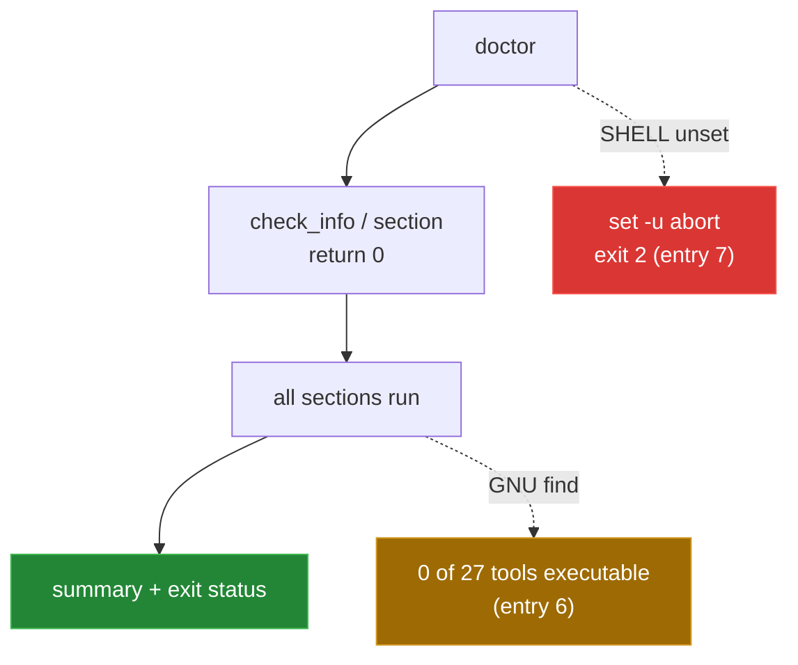

[← back to the overview](../README.md)

# Bugs found

Four bugs were reproduced, reviewed and fixed on `master`. Three more turned
up when everything was re-run in a Linux container (see
[How this was measured](measurement.md)); they are still open.

| # | Entry | Status |
|---|---|---|
| 1 | Suppressed `check_info` aborts `doctor` | Fixed in [`d6bc17a`](https://github.com/Bissbert/topdesk-cli/commit/d6bc17a) |
| 2 | Test shims are not executable | Fixed in [`aa52313`](https://github.com/Bissbert/topdesk-cli/commit/aa52313) |
| 3 | `doctor --quiet` aborts at the first section | Fixed in [`a5c400c`](https://github.com/Bissbert/topdesk-cli/commit/a5c400c) |
| 4 | TAP failures do not affect the exit status | Fixed in [`ab48639`](https://github.com/Bissbert/topdesk-cli/commit/ab48639) |
| 5 | Config tests write to the real user config | Open |
| 6 | `doctor` counts no executable tools on Linux | Open |
| 7 | `doctor` aborts when `SHELL` is unset | Open |

The checks below run inside the container that
[`devtools/linux-run.sh`](../devtools/linux-run.sh) sets up
(`python:3.12-slim-bookworm` with bash, curl, jq and make; `/bin/sh` is dash),
from a copy of the repository.



## 1. Suppressed `check_info` aborts `doctor`

**Status:** fixed in [`d6bc17a`](https://github.com/Bissbert/topdesk-cli/commit/d6bc17a).

**File:** `tools/doctor` (`check_info`)

**What happened:** `check_info` was a short-circuiting test followed by
`printf`. Without `--verbose` the test was false, so the function returned 1,
and `set -e` ended the run after the dependency checks. The configuration,
network, permission and PATH sections and the summary never ran.

**What changed:** `check_info` ends with `return 0`.

**Check:**

```sh
probe=$(mktemp -d)
XDG_CONFIG_HOME="$probe" HOME="$probe" ./bin/topdesk doctor
```

All seven sections and the summary print (`Checks passed: 3`, `Warnings: 3`,
`Checks failed: 3` with an empty config location), and the exit status is 1
because of the failed configuration checks.

## 2. Test shims are not executable

**Status:** fixed in [`aa52313`](https://github.com/Bissbert/topdesk-cli/commit/aa52313).

**Files:** `tests/bin/curl`, `tests/bin/editor`, `tests/helpers.sh`

**What happened:** both shims were mode `0644`, so the shell skipped them on
`PATH` and ran the system `curl`. The suite made real network requests and
most assertions failed.

**What changed:** both files are mode `0755`, and `tests/helpers.sh` stops with
a setup error if `curl` or `editor` does not resolve to the shim.

**Check:**

```sh
stat -c '%A %n' tests/bin/curl tests/bin/editor
make test
```

Both files are `-rwxr-xr-x`. With a fresh `HOME`, 31 of 33 checks pass; the
two failures are entry 5.

## 3. `doctor --quiet` aborts at the first section

**Status:** fixed in [`a5c400c`](https://github.com/Bissbert/topdesk-cli/commit/a5c400c).

**File:** `tools/doctor` (`section`)

**What happened:** `section` had the same shape as `check_info`. With
`--quiet` it returned 1 at the first call and the run ended with no output.

**What changed:** `section` ends with `return 0`.

**Check:**

```sh
XDG_CONFIG_HOME="$probe" HOME="$probe" ./bin/topdesk doctor --quiet
```

It prints only the three failed checks and the warning and failure counts
(5 lines).

## 4. TAP failures do not affect the exit status

**Status:** fixed in [`ab48639`](https://github.com/Bissbert/topdesk-cli/commit/ab48639).

**Files:** `tests/helpers.sh`, `tests/run.sh`

**What happened:** `not_ok` printed a line but kept no count, so `make test`
returned 0 however many checks failed.

**What changed:** `not_ok` increments `TEST_FAILURES`, and `tests/run.sh`
exits 1 after cleanup when it is non-zero.

**Check:** `devtools/linux-run.sh` edits a copy of `tests/run.sh` so check 1
looks for text that is not there, then runs it:

```
not ok 1 - help output
not ok 24 - config init template
not ok 25 - config edit invokes editor
exit=1
```

## 5. Config tests write to the real user config

**Status:** open. Found in the Linux run.

**Files:** `tests/run.sh:191-205`, `tools/config` (`edit_config`),
`lib/config.sh:7-8`, `lib/config.sh:33-43`

**What happens:** checks 24 and 25 set `TOOLBOX_CONFIG_DIR` to a directory
under `tests/` and expect `config init` and `config edit` to write there.
Both commands write to `DEFAULT_USER_CONFIG`, which is
`${XDG_CONFIG_HOME:-$HOME/.config}/topdesk/config`, so:

- checks 24 and 25 always fail;
- the suite creates or edits the developer's own config. The stub editor
  appends `# edited by stub` to it on every run;
- once that file exists, `find_config_file` prefers it over the test
  environment, and its template `TDX_BASE_URL` replaces `http://mock.local`.
  A second run fails 19 checks.

**Reproduce** with a fresh `HOME`:

```sh
make test          # ok=31 not_ok=2
find "$HOME" -type f
make test          # ok=14 not_ok=19
```

```
$HOME/.config/topdesk/config
lines added by the stub editor: 1
ok=14 not_ok=19 exit=2
lines added by the stub editor: 2
```

**Possible fix:** set `XDG_CONFIG_HOME` (and `HOME`) to a directory under
`tests/` in `tests/helpers.sh`, and point checks 24 and 25 at that location,
or make `config init`/`edit` honour `TOOLBOX_CONFIG_DIR` when it is set.

## 6. `doctor` counts no executable tools on Linux

**Status:** open. Found in the Linux run.

**File:** `tools/doctor:286`

**What happens:** the permission check runs
`find "$_root/tools" -type f -perm +111`. `+111` is BSD `find` syntax. GNU
`find` rejects it, the error goes to `/dev/null`, and the count is 0:

```
Checking tool permissions...
! 0 of 27 tools are executable
```

All 27 files are executable, so the warning is false. With `--fix`, `doctor`
runs `chmod +x` on files that already have it.

The measurement scripts in `devtools/` used the same expression and were
changed to `-perm -u=x`, which BSD and GNU `find` both accept.

**Possible fix:** use `-perm -u=x` (or test each file with `[ -x ]`).

## 7. `doctor` aborts when `SHELL` is unset

**Status:** open. Found in the Linux run.

**File:** `tools/doctor:143`

**What happens:** `doctor` runs with `set -u` and prints
`check_info "Shell: $SHELL"`. When `SHELL` is not set (for example in
`docker run`, some cron and systemd environments, or `env -i`), the shell
stops:

```
./tools/doctor: 143: SHELL: parameter not set
exit=2
```

**Possible fix:** use `${SHELL:-unknown}`.
