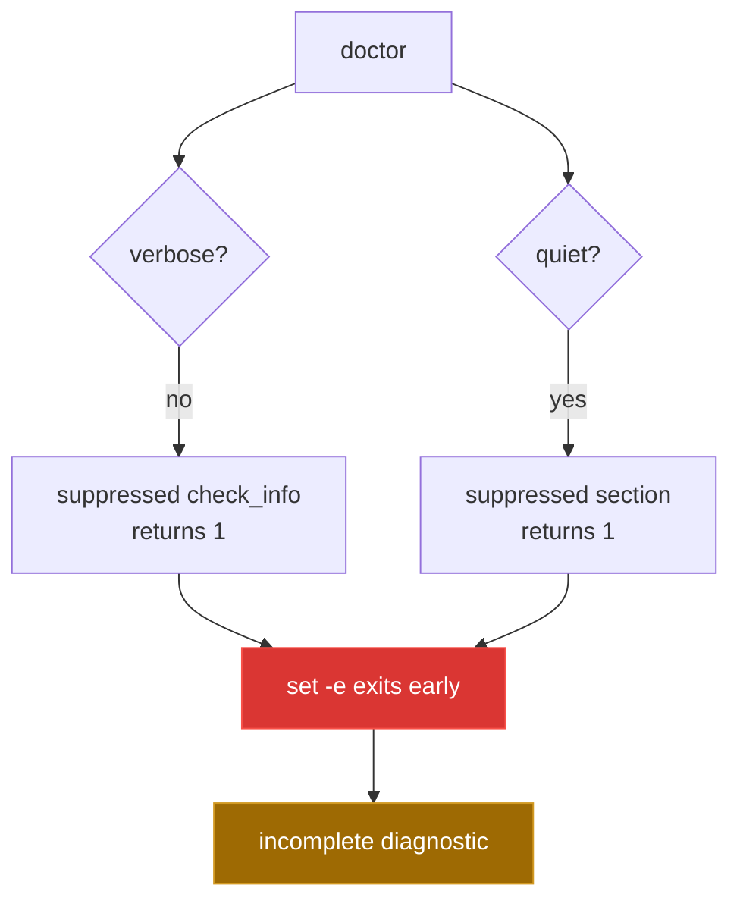

[← back to the overview](../README.md)

# Bugs found

This pass did not change tracked product code. The saved working-tree patch
contained two behavioral fixes for `tools/doctor` and executable-bit fixes for
the test shims; all are recorded below and remain unfixed in the repository.



## `tools/doctor:107-109` — suppressed `check_info` can abort the default run

`check_info` consists of a short-circuiting test followed by `printf`. When
verbose mode is off, the test is false and the function returns status `1`.
Because the script uses `set -e`, a top-level call to `check_info` can terminate
the health check before configuration, network, permissions, or its summary are
examined.

Reproduction, verified against the current source with an empty temporary
configuration location:

```sh
probe_dir=$(mktemp -d /tmp/topdesk-doctor-probe.XXXXXX)
XDG_CONFIG_HOME="$probe_dir" ./bin/topdesk doctor
printf 'status=%s\n' "$?"
```

The run printed the header and dependency results, then exited with status `1`
before the configuration section. The cause is the first non-verbose call at
`tools/doctor:141`.

The fix I would have made, but did not apply:

```diff
diff --git a/tools/doctor b/tools/doctor
@@
 check_info() {
   [ $VERBOSE -eq 1 ] && printf "${BLUE}ℹ${NC} %s\n" "$*"
+  return 0
 }
```

## `tests/bin/curl` and `tests/bin/editor` — test shims are not executable

Both helper files are mode `0644`, so the shell cannot execute them when the
test directory is placed at the front of `PATH`. The suite therefore finds the
system `curl` instead of the mock and cannot invoke the editor shim. This turns
offline tests into network attempts and makes output assertions fail.

Reproduction, verified in a clean snapshot of the tracked source:

```sh
make test
```

The run attempted a real network request, reported curl resolution errors, and
produced `5` passing and `28` failing TAP checks. The mode check was also
verified directly: both files reported `-rw-r--r-- 644`.

The fix I would have made, but did not apply:

```diff
diff --git a/tests/bin/curl b/tests/bin/curl
old mode 100644
new mode 100755
diff --git a/tests/bin/editor b/tests/bin/editor
old mode 100644
new mode 100755
```

## `tools/doctor:111-113` — quiet mode can abort at the first section

`section` has the same status problem. With `--quiet`, the short-circuiting test
is false, so the function returns `1` and `set -e` exits before the first check.
This makes quiet mode produce no diagnostic result at all.

Reproduction, verified against the current source:

```sh
probe_dir=$(mktemp -d /tmp/topdesk-doctor-probe.XXXXXX)
XDG_CONFIG_HOME="$probe_dir" ./bin/topdesk doctor --quiet
printf 'status=%s\n' "$?"
```

The command produced no output and exited with status `1` at the first section
call, `tools/doctor:120`.

The fix I would have made, but did not apply:

```diff
diff --git a/tools/doctor b/tools/doctor
@@
 section() {
   [ $QUIET -eq 0 ] && printf "\n${BLUE}%s${NC}\n" "$*"
+  return 0
 }
```

## `tests/run.sh:279` — TAP failures do not affect the process status

The test runner calls `ok` and `not_ok` while it prints the TAP stream, but it
does not retain a failure count or exit non-zero after the final cleanup. As a
result, `make test` can report failed checks and still return success.

Reproduction, verified in a clean snapshot of the tracked source:

```sh
make test
printf 'status=%s\n' "$?"
```

The observed result was `5` `ok` lines, `28` `not ok` lines, and process status
`0`. The missing status decision is at the end of `tests/run.sh`, after the
cleanup at line `279`.

The fix I would have made, but did not apply, is to let the existing helper
track failures and return that result after cleanup:

```diff
diff --git a/tests/helpers.sh b/tests/helpers.sh
@@
 TEST_CURL_LOG=${TEST_CURL_LOG:-"$TEST_DIR/.curl.log"}
 rm -f "$TEST_CURL_LOG" 2>/dev/null || :
+FAILURES=0
@@
-not_ok() { n=$1; shift; printf 'not ok %s - %s\n' "$n" "$*"; }
+not_ok() { n=$1; shift; FAILURES=$((FAILURES + 1)); printf 'not ok %s - %s\n' "$n" "$*"; }

diff --git a/tests/run.sh b/tests/run.sh
@@
 rm -f "$errfile"
+[ "$FAILURES" -eq 0 ]
```

This is a proposed diff only; it was not applied.

## Other hunks in the saved patch

The saved patch also contained the README documentation rewrite, test-run
artifacts, and a final-newline change in `tools/doctor`. Those hunks are not
additional behavior bugs: the README changes belong to this documentation
pass, the log and error-file changes came from a test run, and the newline has
no runtime effect. No source-code fix from the patch was reapplied.
