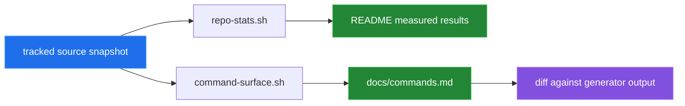

[← back to the overview](../README.md)

# How this was measured

Every number published by this documentation pass comes from a command run
against the repository source. The measurement scripts are in
[`../devtools/`](../devtools/) rather than the product's `tools/` directory.



## Source shape and command surface

`devtools/repo-stats.sh` counts the shell files under `bin/`, `lib/`, and
`tools/`, then prints their aggregate line and byte counts. It also counts the
executable product tools. `devtools/command-surface.sh` scans each executable
in `tools/` for its methods, default path, option labels, and line count, and
prints the Markdown table used by [`commands.md`](commands.md).

The scripts were run against a clean snapshot of the tracked source so the
table does not inherit unrelated worktree changes. The resulting values are
copied into the README and the generated command table; rerun the scripts after
source changes.

## Local verification

The following checkout-only commands were run successfully:

```sh
./bin/topdesk --version
./bin/topdesk help
./bin/topdesk config --help
./bin/topdesk doctor --help
```

These commands do not require a tenant. The bug reproductions in
[`BUGS-FOUND.md`](BUGS-FOUND.md) were also run with an isolated temporary
configuration location; their non-zero statuses are the current behavior being
documented.

## Test-suite boundary

`make test` was run in a clean tracked snapshot, not in the documentation
working tree. It printed `5` `ok` lines and `28` `not ok` lines, then returned
status `0`; the runner currently does not propagate TAP failures. Because the
test shims are not executable, the run also attempted real network requests.
This result was not used as evidence of a real API response. The test suite is
intended to use a curl shim, but the current file modes prevent that.

## What was not measured

No real Topdesk hostname, tenant, credential, incident, attachment, response
body, server latency, or network throughput was available. No API operation was
run against a live service, and no animation was generated. The Mermaid
diagrams are source-based explanations, not captured terminal recordings.
