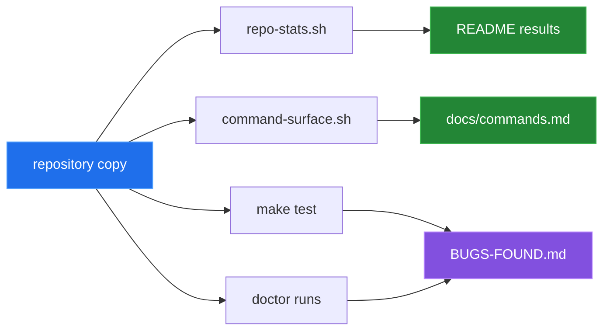

[← back to the overview](../README.md)

# How this was measured

Every number in this documentation comes from one script run in a Linux
container:

```sh
sh devtools/linux-run.sh > docs/captures/linux-run.txt
```

[`devtools/linux-run.sh`](../devtools/linux-run.sh) starts
`python:3.12-slim-bookworm`, installs bash, curl, jq, make and git, mounts the
repository read-only and copies it. No Topdesk tenant is contacted: the test
suite uses the curl shim in `tests/bin`, and the `doctor` runs use an empty
temporary config location. The full output is
[`captures/linux-run.txt`](captures/linux-run.txt); every block below is taken
from it.



## Environment

| | |
|---|---|
| Kernel | Linux 6.5.11-linuxkit, aarch64 (Docker Desktop VM) |
| Image | `python:3.12-slim-bookworm` (`sha256:392307d2…23564e`) |
| Tools | GNU bash 5.2.15, curl 7.88.1, jq 1.6; `/bin/sh` is dash |
| Date | 2026-09-24 |

## Source shape

`devtools/repo-stats.sh` counts the shell files under `bin/`, `lib/` and
`tools/`, and the executable product tools:

```
shell files            35
shell lines            3538
shell bytes            101111
subcommands            27
version                0.1.0
```

`sh -n` reports no syntax errors in any of the 35 files under dash.

## Command table

`devtools/command-surface.sh` scans each executable in `tools/` and prints the
table in [`commands.md`](commands.md). Its output is identical to
that file (35 lines).

## Local commands

These run from the checkout and need no tenant:

```
topdesk --version  exit=0
topdesk help  exit=0
topdesk config --help  exit=0
topdesk doctor --help  exit=0
```

## Test suite

`make test` with a fresh `HOME`:

```
ok=31 not_ok=2 exit=2
```

Checks 24 (`config init template`) and 25 (`config edit invokes editor`) fail.
Both write to the real user config instead of the test directory, and a second
run in the same `HOME` fails 19 checks. That is entry 5 in
[Bugs found](BUGS-FOUND.md).

With one check deliberately broken in a copy of `tests/run.sh`, the runner
reports it and exits 1, so TAP failures reach the exit status (entry 4).

## `doctor`

With an empty config location, the default run prints all seven sections and
the summary:

```
Summary
Checks passed: 3
Warnings: 3
Checks failed: 3
```

`--quiet` prints the three failed checks and the two counts (5 lines).
`--verbose` adds 17 info lines. The permission section reports
`0 of 27 tools are executable` although all are (entry 6), and with `SHELL`
unset the run stops at `tools/doctor:143` with exit 2 (entry 7).

## Not covered

No Topdesk hostname, tenant, credential, incident, attachment, response body,
server latency or network throughput was available. No API operation was run
against a live service; the API tests use the curl shim. The Mermaid diagrams
describe the source; they are not captured program output.
